# trabalho-final
## Jogo One-Click (Fruit Snake)

#### Tentativa de programação do jogo, falta colocar os layouts e os elementos gráficos, o sistema de misturar cores também não está a funcionar como deveria, não tem sistema de power-up.
##### Foi utilizado chat-gpt para a programação do que seria o conceito do jogo.

##### imagem do codigo do jogo em pdf
  

 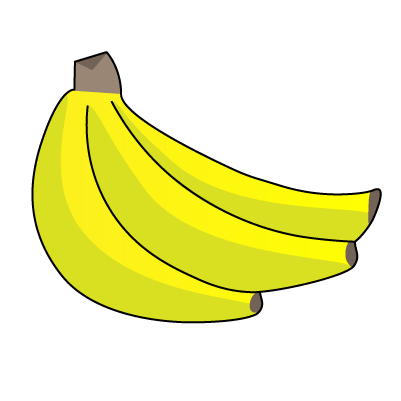  
 ##### Banana
 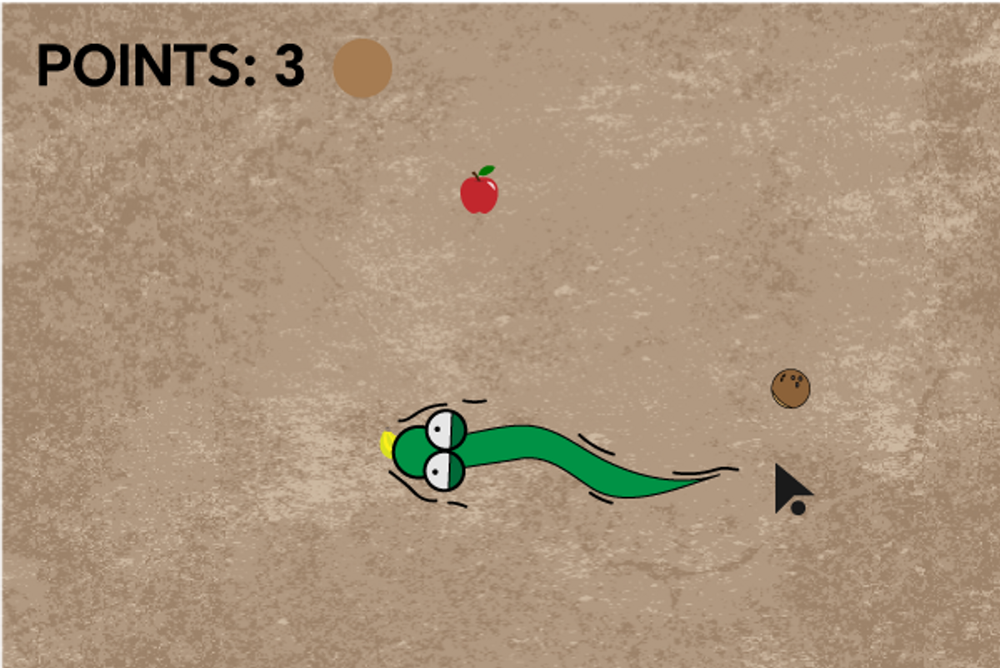 
 ##### imagem da cobra a comer a banana
 ## Banana- dá velocidade 

                                                                             
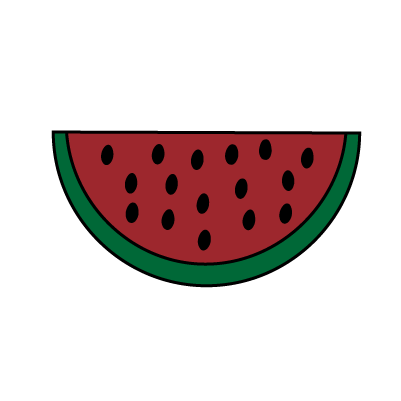    
##### Melancia
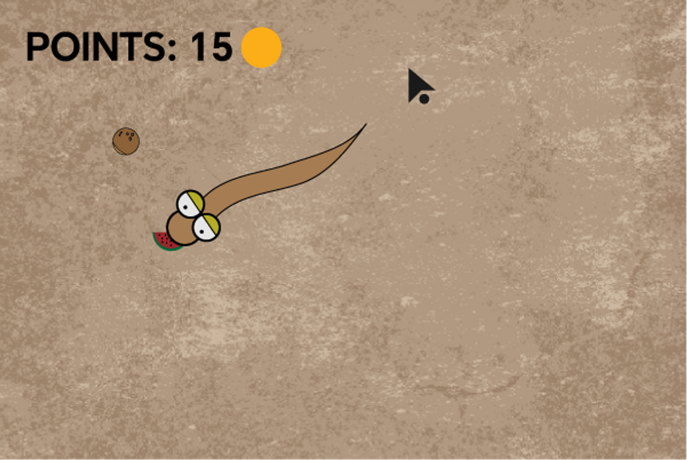   
#####  imagem da cobra depois de comer a melancia
###### Cobra depois de comer a melancia, fica verde(da cor original) 
                                                           
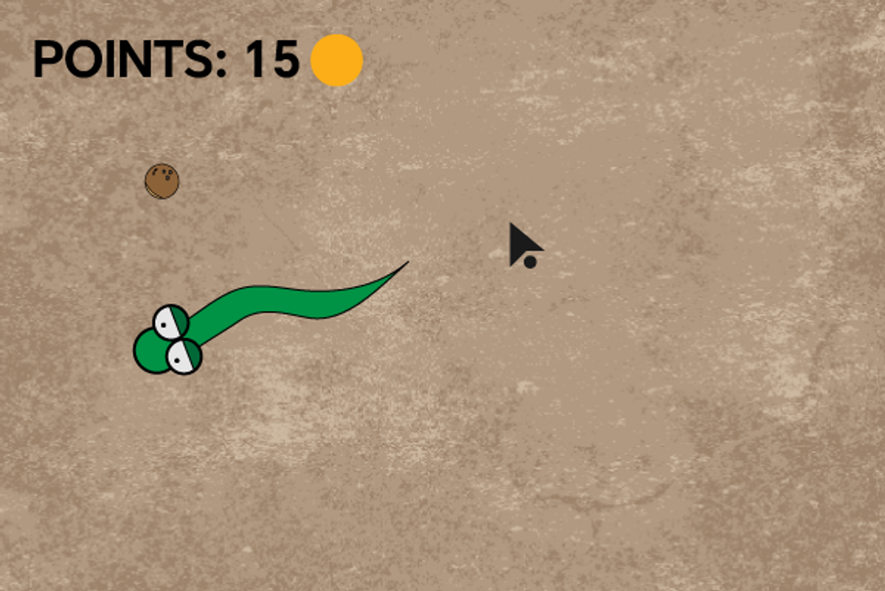   

                                                                                
## Melancia - A Cobra volta à cor original  

                                                                                
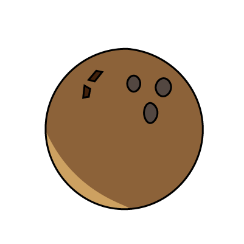 
##### Coco
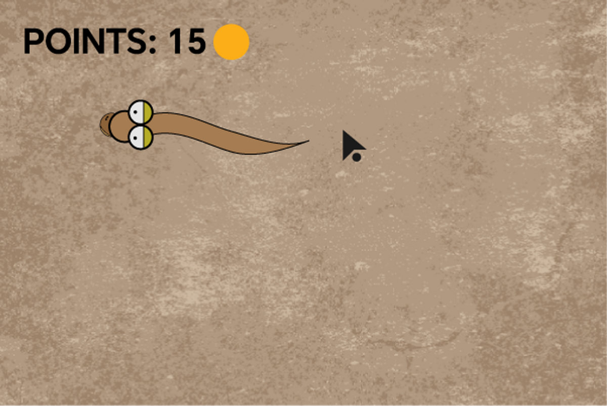   
##### imagem da cobra castanha a comer o coco 
###### Cobra morta por ter comido o coco                                                           
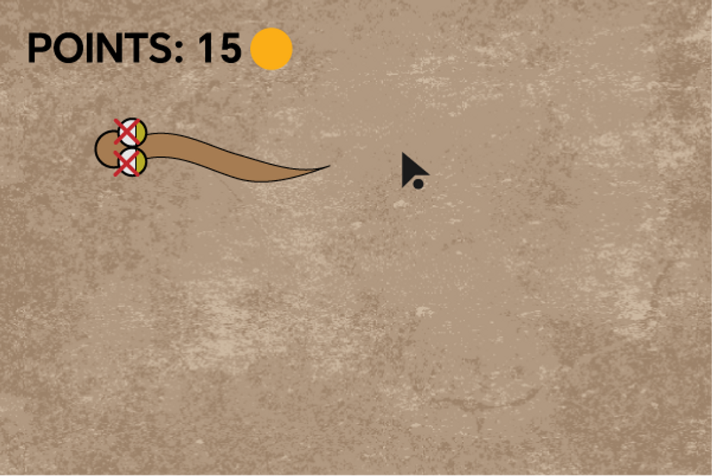   
                                                                               
                                                                                
## Coco- Mata a cobra

 ## Cobra                                                                                
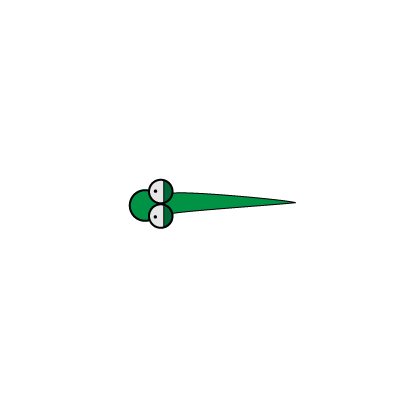 
                                                                                 
#### Várias direções dentro do jogo
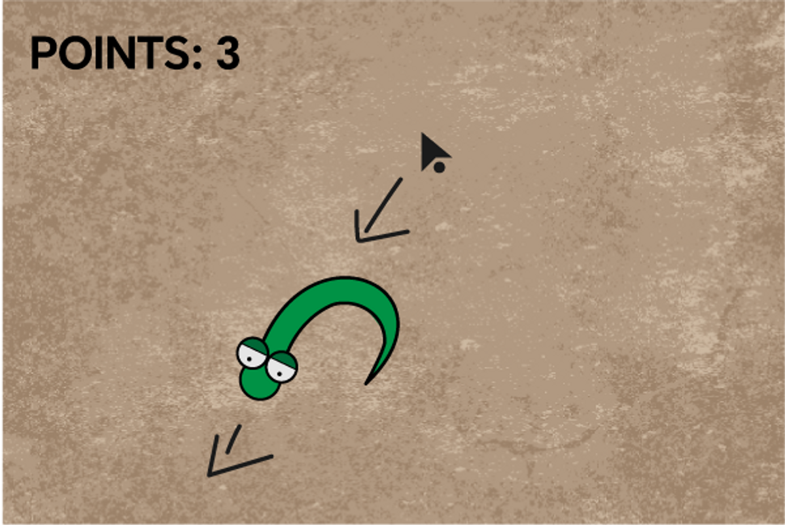
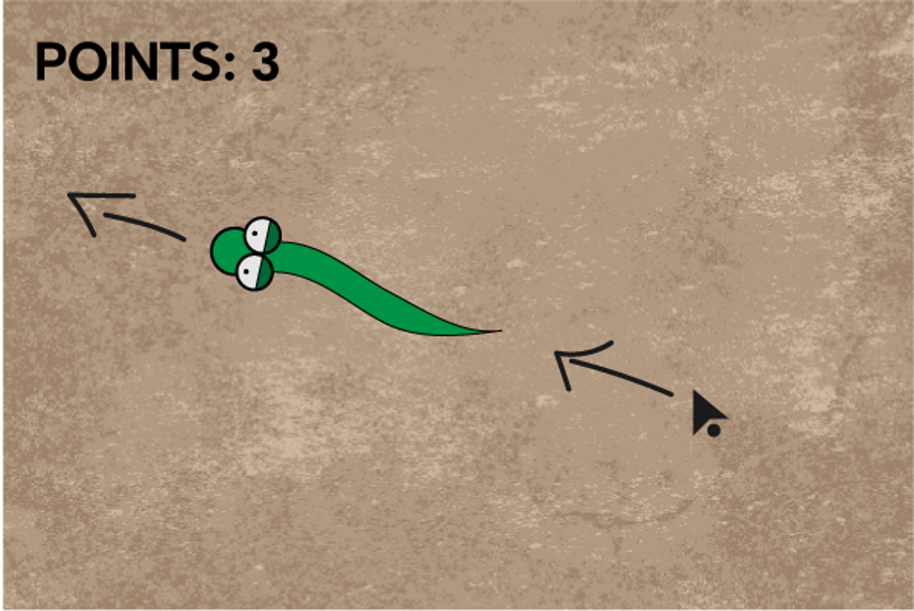

 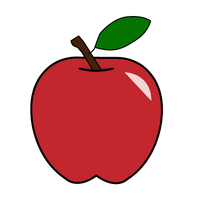      
## Maçã Vermelha
 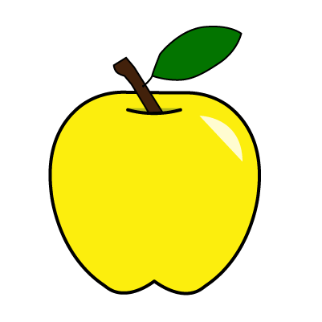      
## Maçã Amarela
 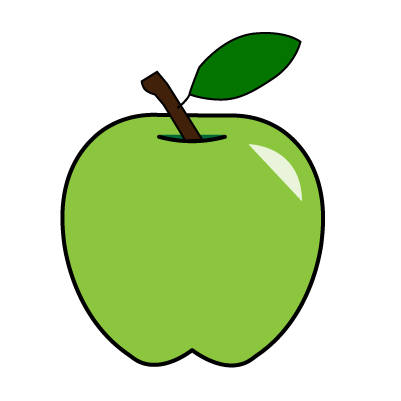      
## Maçã verde
 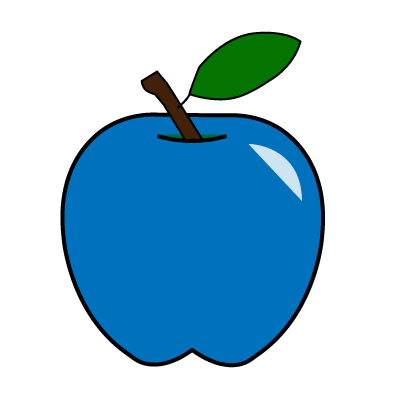      
## Maçã Azul

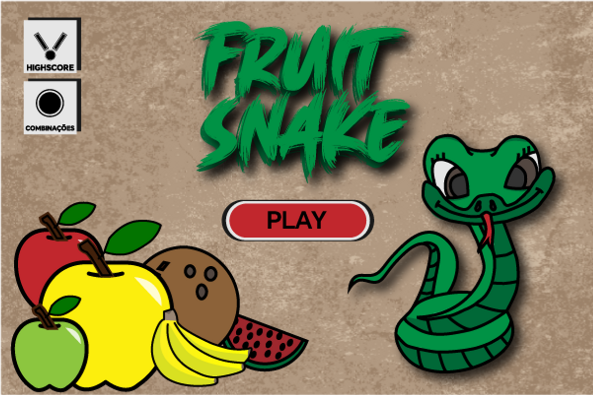 
#                                           Tela inicial do jogo, consiste em 3 botões que se pode interagir:

#### *HIGHSCORE - Mostra a tabela de melhore pontuações
#### *COMBINAÇÕES - Combinações de cores e os seus resultados
#### *PLAY - Começa o jogo

               
## Movimento do personagem:
A cobra segue em direção oposta à posição do cursor como se dele estivesse a fugir. 
 
 

 ### imagem da LISTA da combinção de cores    
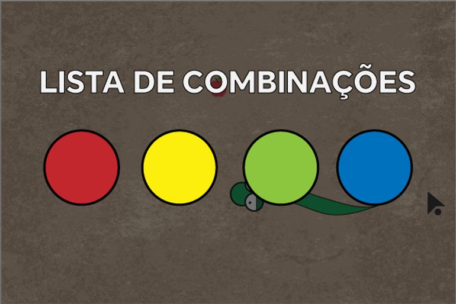 
 ### imagem da conjução/combinação das cores
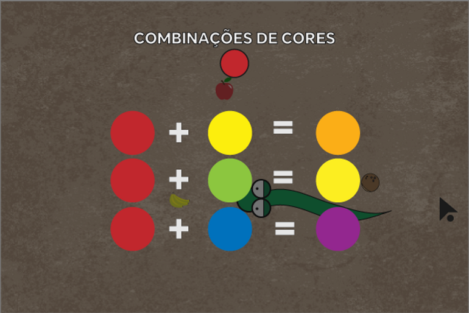 

## Lista de Combinações:
Ao clicar na tecla C ou clicar no botão ‘’COMBINAÇÕES’’ presente na tela inicial irá levar a uma tela onde pode clicar em qual das combinações de cor quer ver.

#                                                                 Vídeo de promoção / explicação do jogo

 Link- https://www.youtube.com/shorts/ETpwQaJfmu4

#                                                                 Merchandising

## Mock-up T-Shirt
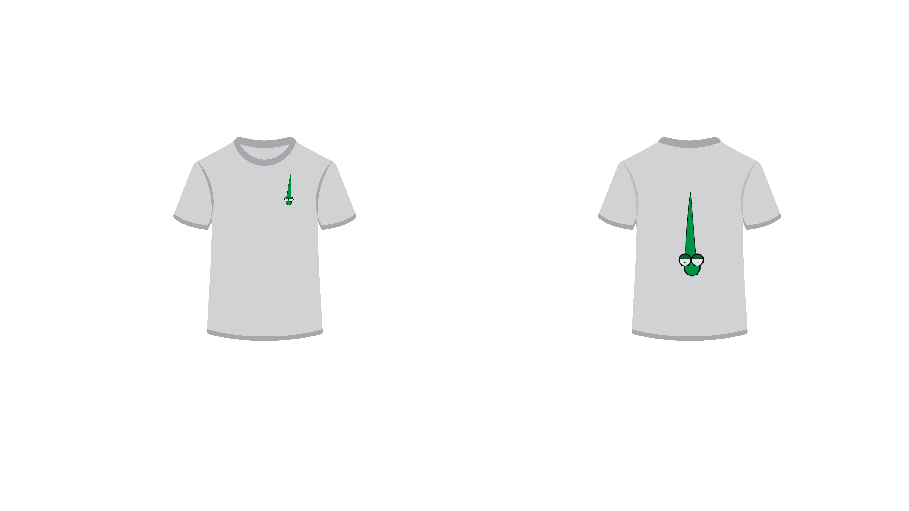    

## Mock-up Chapéu 
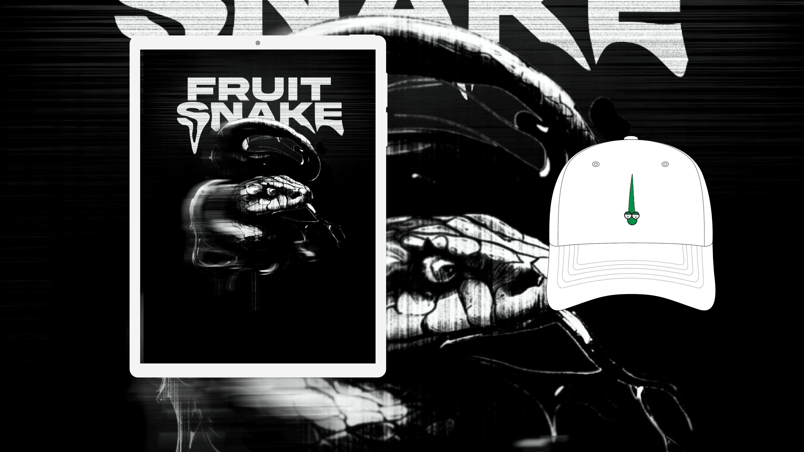 
